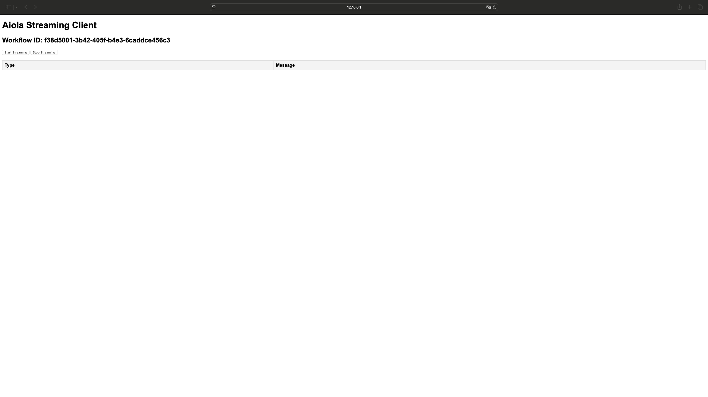

# aiOla Streaming Vanilla JS SDK
## Transcript & Events Example

###### this example demonstrates how to use the aiOla Streaming SDK to capture live transcripts and handle backend-triggered events.

#### Spin up the example (using http-server)

Install http-server globally:
   ```bash
   npm install -g http-server
   ```
2. Run in the project directory:
   ```bash
   http-server
   ```
3. Open your browser and navigate to `http://localhost:<check_port_in_the_console>`



> **Note**: Due to security restrictions, modern browsers require a secure context (HTTPS or localhost) to access the microphone. Running directly from `file://` protocol won't work for microphone access.