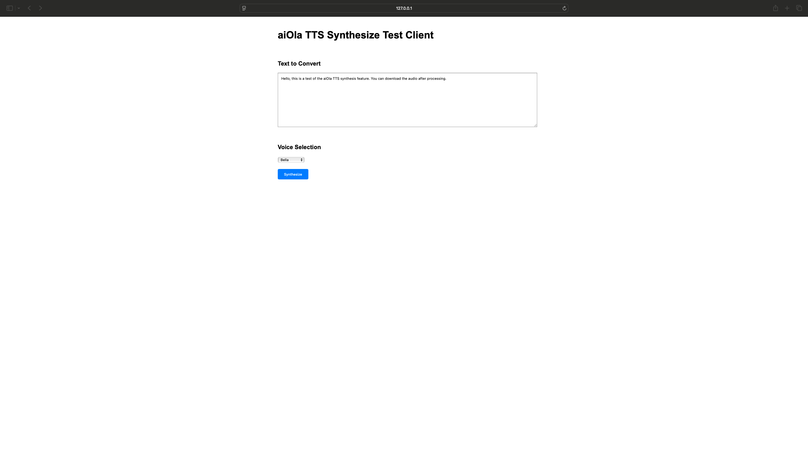

# aiOla TTS Synthesize Vanilla JS SDK
## Synthesize Speech Example

###### this example demonstrates how to use the aiOla TTS SDK to synthesize speech and download the audio file as a `.wav`.

#### Spin up the example (using http-server)

Install http-server globally:
   ```bash
   npm install -g http-server
   ```
2. Run in the project directory:
   ```bash
   python cors_server.py
   ```
3. Open your browser and navigate to `http://localhost:3000`



> **Note**: Due to security restrictions, modern browsers require a secure context (HTTPS or localhost) to access the microphone. Running directly from `file://` protocol won't work for microphone access.